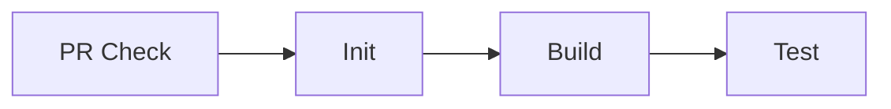

# Overview
**Weaver** is an open-source project designed to provide a comprehensive collection of Infrastructure as Code (IaC) configurations for quickly and efficiently creating various cloud-based architectures. Inspired by the intricate nests constructed by weaver birds, this project aims to interlace proven patterns and best practices to help developers and DevOps engineers deploy complex environments with ease.

# Motivation
In the tech industry I've experienced, many common problems have established solutions that follow well-known patterns. However, these patterns are often described in materials without accompanying IaC code, making it challenging for professionals to implement and test them promptly. This gap hinders the ability to visualize and understand the trade-offs between different architectural choices.

**Weaver** addresses this issue by offering ready-to-use IaC configurations for a wide range of cloud architecture patterns. By bridging the gap between theoretical knowledge and practical application, the project enables users to experiment with and learn from real-world cloud environments without the usual setup complexities.

# Goals
- **Accelerate Learning** : Provide immediate access to deployable cloud architectures, allowing users to test and understand environments right after studying them.
- **Comprehensive Patterns** : Assemble a diverse set of cloud architecture patterns and solutions to cover a wide range of use cases and requirements.
- **Promote Best Practices** : Ensure all IaC configurations follow industry best practices, emphasizing modularity, reusability, and clarity.
- **Enhance Efficiency** : Reduce the time and effort required to set up cloud environments, enabling users to focus on learning.
- **Community Collaboration** : Foster an open environment for contributions, feedback, and shared learning to continuously improve the project.

# Rules
- Use English only.
- Restrain from mixing multiple architectures in a single directory. Every pattern is isolated in its own directory.
- Copy pattern_template folder to architectural_patterns and rename it to the pattern name when you start to create a new pattern. It contains necessary components for a pattern. It might occur errors in Actions flow if you remove any of them. There are some explanations about the components below.

| File/directory | Comments                                                                                                                        |
|----------------|---------------------------------------------------------------------------------------------------------------------------------|
| README.md      | It should be included in the pattern directory.                                                                                 |
| doc            | Drawio file is required. It would be helpful to maintain after it's merged                                                      |
| scripts        | It has at least 5 shell scripts. init.sh, build.sh, test.sh, deploy.sh, clean.sh                                                |
| dockerfile     | Establish the environment to build, deploy, test the pattern                                                                    |
| test           | At least 1 test logic should be included e.g. communication test in rest api architecture, calculating data processing time etc |

- Follow [Conventional Commits](https://www.conventionalcommits.org/en/v1.0.0-beta.4/) for commit messages.
- Main dependencies in the pattern should be used with specific versions. This ensures that the pattern can be run without any issues in the future.
- Restrain from using remote iaC modules(e.g. terraform registry public module). This increases unnecessary external dependencies and may not be suitable for the goals of this project.

# GitHub Actions Workflow
## PR to Main Branch

There are 4 jobs when PR is created to the main branch. 
Init and Build jobs must include initializing a docker container because GitHub Actions save the container to convey the artifact to the next job. 

1. **PR Check** :
   - Verifies the PR follows directory change rules. 
   - Allows only one directory under architectural_patterns/ to be modified. 
   - Posts a comment and fails the check if the rules are not met.
2. **Init** :
   - Should include initiating process such as preparing the environment for building, testing, and deploying the specified pattern.
   - Run `architectural_patterns/{pattern_name}/scripts/init.sh` to initialize the pattern.
3. **Build** :
   - Should contain building process
   - Run `architectural_patterns/{pattern_name}/scripts/build.sh` to build the pattern.
4. **Test** :
   - Should have test process
   - Run `architectural_patterns/{pattern_name}/scripts/test.sh` to test the pattern.

# License
This repository is licensed under the BSD 3-Clause License. Third-party tools and libraries (e.g., Terraform, OpenTofu, etc.) may be subject to their own licenses. Please refer to each tool's documentation for specific licensing terms.
