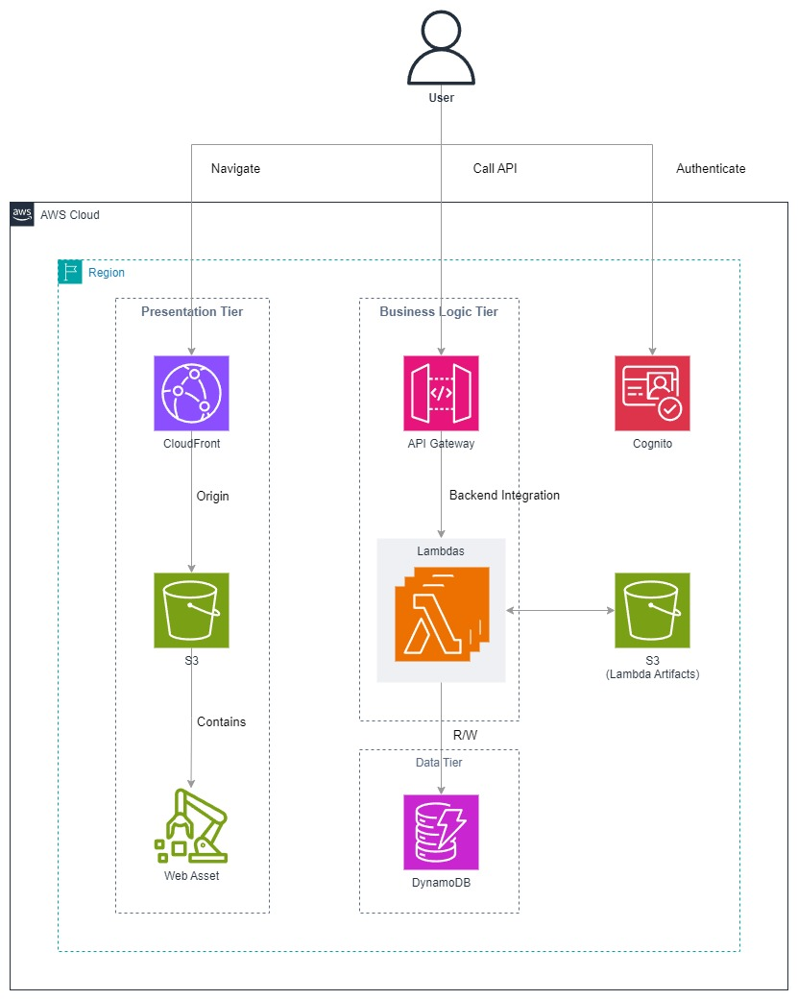

# Diagram

# Main Services in Use
Example:

| Service Name | Role in Design                                      | Comments                                                       |
|--------------|-----------------------------------------------------|----------------------------------------------------------------|
| CloudFront   | CDN, Distribution                                   |                                                                |
| S3           | Origin for CloudFront, Storage for Lambda Artifacts |                                                                |
| Cognito      | Authentication                                      | Manages user sign-up, sign-in, and token-based authentication. |
| API Gateway  | API Gateway                                         |                                                                |
| AWS Lambda   | Serverless compute                                  |                                                                |
| DynamoDB     | NoSQL Database                                      |                                                                |

# Prerequisites
- Ensure an active AWS account.
- Install Docker on your local machine.
- Configure a .env file before starting.

# Getting Started
| Step | Command       | Comments                       |
|------|---------------|--------------------------------|
| 1    | `cd scripts`  | Navigate to the scripts folder |
| 2    | `./init.sh`   | Initiate the Docker container  |
| 3    | `./deploy.sh` | Deploys Environment            |
| -    | `./clean.sh`  | Remove Environment             |

If you want to test the Business Logic Tier, You should create a user in Cognito User Pool and issue an access token to pass authorizer in API Gateway
For that, you can use AWS Console or aws cli commands following as
- [aws cognito-idp sign-up](https://docs.aws.amazon.com/cli/latest/reference/cognito-idp/sign-up.html)
- [aws cognito-idp admin-confirm-sign-up](https://docs.aws.amazon.com/cli/latest/reference/cognito-idp/admin-confirm-sign-up.html)
- [aws cognito-idp initiate-auth](https://docs.aws.amazon.com/cli/latest/reference/cognito-idp/initiate-auth.html)

# Best-Suited Scenarios for This Architecture
This is the architecture from [AWS Blog Post](https://aws.amazon.com/blogs/architecture/building-a-three-tier-architecture-on-a-budget/).
The post highlights the main purpose of this architecture is to create a web hosting setup using AWS Free Tier as much as possible.
It combines affordable AWS services to maximize Free Tier benefits, and the advantages of this setup are detailed in the post.

As mentioned, this architecture is a good choice if you aim to quickly and affordably set up infrastructure for a service that can scale from small to medium size. However, consider the following factors:

- Vendor Lock
    - Since this architecture heavily relies on AWS-managed services, there is a significant risk of vendor lock-in.
    - If you foresee a need to migrate your service to another cloud provider or on-premises infrastructure in the future, this architecture may not be ideal.
- Maintenance
    - Handling multiple Lambda functions can become complex as your service grows. Proper monitoring, logging, devOps Strategies and alerting setups are essential to maintain service reliability.
- Cost
    - This is definitely affordable option. however It would be always a good idea to find out what cost are after the free tier and what cost are when the service scales up significantly.
- Governance and Security
    - Many resources in this architecture such as Lambda operate outside a VPC, which may not meet strict compliance or security requirements. Linking resources to a VPC with services like NAT Gateway or PrivateLink can address this but will significantly increase costs, reducing the architecture's affordability.
- Tech Stack Limitation
    - This architecture is ideal for modern JAMstack or API-driven designs but unsuitable for full-stack frameworks like Laravel, Ruby on Rails, or Django, which require tightly integrated frontend-backend rendering or persistent servers.

So, the best-suited scenarios for this architecture are situations where you want an affordable setup for web hosting, and the above concerns don't pose significant challenges for your use case.

# References
- https://aws.amazon.com/blogs/architecture/building-a-three-tier-architecture-on-a-budget

#aws #affordable