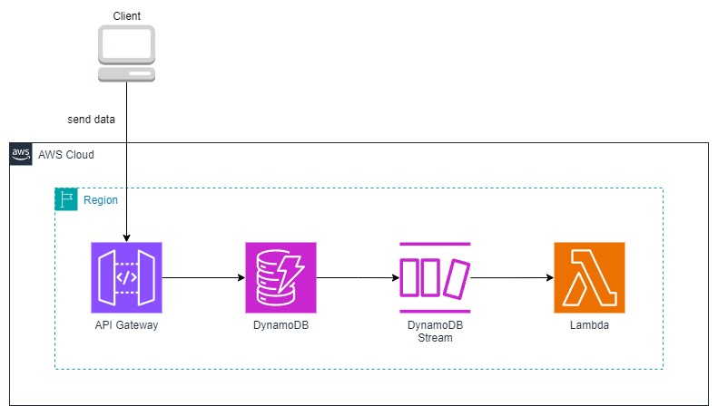

# Diagram

# Main Services in Use
Example:

| Service Name | Role in Design             | Comments                               |
|--------------|----------------------------|----------------------------------------|
| API Gateway  | Proxy to DynamoDB          | It uses an API Gateway mapping feature |
| DynamoDB     | DB for data ingestion      | It uses DynamoDB Stream                |
| Lambda       | Handler of DynamoDB Stream | It's triggered by DynamoDB Stream      |

# Prerequisites
- Ensure an active AWS account.
- Install Docker on your local machine.
- Configure a .env file before starting.

# Getting Started
| Step | Command                                 | Comments                                |
|------|-----------------------------------------|-----------------------------------------|
| 1    | `cd scripts`                            | Navigate to the scripts folder          |
| 2    | `./init.sh`                             | Initiate the Docker container           |
| 3    | `./test.sh`                             | Test the Python codes (Unit Test)       |
| 4    | `./deploy.sh`                           | Deploys the environment                 |
| -    | `python ./test/e2e_performance_test.py` | Test e2e data ingestion after deploy.sh |
| -    | `./clean.sh`                            | Remove the environment                  |

# Implementation Objective
Implement the architecture described in the link below and verify its performance:
- https://aws.amazon.com/ko/blogs/compute/using-amazon-api-gateway-as-a-proxy-for-dynamodb/

# Best-Suited Scenarios for This Architecture
This architecture is well-suited for scenarios requiring:
- **Serverless Real Time Data Ingestion:** Applications needing lightweight and cost-effective real time data ingestion solutions without requiring a full server-based backend.
- **High Scalability:** Use cases where the application must handle sudden spikes in traffic and scale seamlessly, leveraging the scalability of API Gateway and DynamoDB.
- **Simplified Management:** Workloads aiming to reduce operational complexity by using fully managed AWS services, ensuring minimal maintenance and easy integration.
- **Low-Latency Operations:** Systems requiring quick responses for CRUD operations, as API Gateway provides a direct proxy to DynamoDB with minimal processing overhead.

This architecture may not be suitable for scenarios involving:
- **AWS Dependency:** The architecture heavily relies on AWS services like DynamoDB, making it difficult to migrate to a multi-cloud or on-premise environment.
- **Limited Communication Patterns:** It only supports bidirectional communication, not true two-way communication. For real-time data fetching or streaming, alternative architectures like WebSocket APIs or streaming solutions (e.g., Kinesis or Kafka) are better suited.
- **Complex Backend Logic:** Applications requiring sophisticated business logic, data transformation, or custom workflows may outgrow the simple API Gateway-to-DynamoDB proxy model.
- **Batch Processing:** Use cases that involve processing large batches of data may be better suited for services like AWS Batch or EMR rather than API Gateway and DynamoDB.

# Simple Performance Test
## How to Test
I've run `./test/e2e_performance_test.py` to test the performance of the architecture. The test script sends 10 times of 10 requests at the near same time using Python concurrent.futures to the API Gateway endpoint and checks the response time and success rate.

## Test Results
I've got the following results after running the performance test script from Tokyo, Japan to the API Gateway deployed in ap-northeast-1 region. (WCU in DynamoDB is set to 20)

| Metric                        | Value   | Notes                                                                                        |
|-------------------------------|---------|----------------------------------------------------------------------------------------------|
| Overall Success Rate          | 100.00% | Total Success / Total Requests                                                               |
| Total Time Taken              | 6.97s   | Total duration to complete 100 requests                                                      |
| Overall Average Response Time | 0.67s   | Average response time calculated as the sum of 10 requests (repeated 10 times) divided by 10 |
| Batch Average Total Time      | 0.70s   | Average time taken per batch                                                                 |

you can see the detailed results in the `./test/result_e2e_performance_test.txt` script.

# Potential Alternatives for This Architecture

| Service                                   | Data Ingestion | Data Processing | Development Cost | Running Cost | Two-Way Communication             |
|-------------------------------------------|----------------|-----------------|------------------|--------------|-----------------------------------|
| **API Gateway + DynamoDB (this pattern)** | Real-time      | Near-real-time  | Low              | Medium       | Limited (WebSocket add-on needed) |
| **Kinesis Data Streams**                  | Real-time      | Real-time       | Medium           | Medium-High  | Possible                          |
| **Amazon MSK (Kafka)**                    | Real-time      | Real-time       | High             | High         | Fully supported                   |
| **Apache Flink (Kinesis Data Analytics)** | Real-time      | Real-time       | Medium           | Medium-High  | Not inherently supported          |
| **Amazon SQS**                            | Near-real-time | Near-real-time  | Low              | Low          | Not inherently supported          |

# References
- https://aws.amazon.com/ko/blogs/compute/using-amazon-api-gateway-as-a-proxy-for-dynamodb/

#aws #api_gateway #dynamodb #data_ingestion