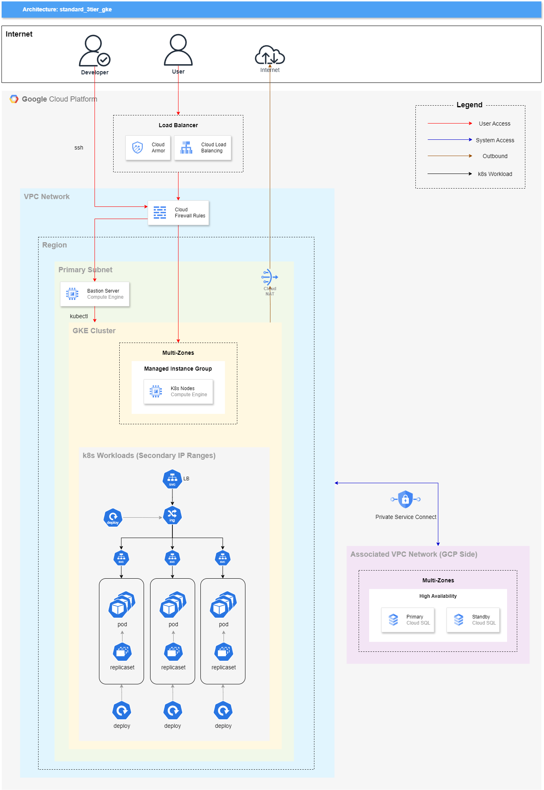

# Diagram


# Main Services in Use

| Service Name                          | Role in Design                | Comments                                                                                       |
|---------------------------------------|-------------------------------|------------------------------------------------------------------------------------------------|
| Google Compute Network (VPC)          | Virtual Private Cloud         | Custom subnets for isolation of workloads and Kubernetes ranges.                               |
| Google Compute Engine (Firewall, NAT) | Networking and Security       | Ensures secure access and egress from workloads.                                               |
| Google Kubernetes Engine (GKE)        | Kubernetes Cluster Management | GKE Standard Mode used to maintain CSP independence.                                           |
| Kubernetes                            | Workload Orchestration        | Focused on using standard Kubernetes features for workload management and application scaling. |
| Kubernetes Ingress                    | Load Balancing                | Configured with NGINX ingress controller for CSP-independent traffic management.               |

# Prerequisites
- Ensure an active Google Cloud Platform (GCP) project.
- Ensure Docker is installed on your machine, and use appropriate service account to deploy. 
- Configure a .env file before starting.
- Ensure APIs(Cloud Resource Manager, Compute Engine, Kubernetes Engine) is enabled before deploy. Run the following commands in your cloud shell if it's not.
  ```bash
  gcloud services enable compute.googleapis.com \
      cloudresourcemanager.googleapis.com \
      container.googleapis.com
  ```
- Ensure you have a managed service account for GCP compute operations, or set up appropriate IAM roles for service accounts.

# Getting Started

TBU

# Key Features of the Architecture

1. **CSP Independence for Kubernetes Workloads**:
    - Avoids CSP-specific annotations and features like GKE Autopilot.
    - Maintains portability and standardization across cloud providers or on-premises Kubernetes environments.

2. **Managed Services for Non-Workload Components**:
    - Reliance on GCP-managed services like firewalls, NAT, and VPC for infrastructure.
    - Balances operational simplicity with minimizing CSP dependency for core workloads.

3. **Kubernetes Default Features**:
    - Uses native Kubernetes capabilities like `Deployments`, `Ingress`, and `HorizontalPodAutoscaler` for maintainability and reduced complexity.
    - Simplifies onboarding and reduces operational overhead for teams with basic Kubernetes familiarity.

# Best-Suited Scenarios for This Architecture

This architecture is ideal for teams aiming to:

- Maintain portability and minimize vendor lock-in by avoiding CSP-specific dependencies in Kubernetes workloads.
- Build scalable and secure web applications with clear separation of responsibilities:
    - Networking and security managed via CSP-native solutions.
    - Workload orchestration handled entirely in Kubernetes.
- Use standard Kubernetes features for maintainability and a balanced learning curve.

### Considerations:

- **Learning Curve**: Kubernetes inherently has a steep learning curve. Keeping the architecture simple with standard features helps reduce this.
- **Cost Efficiency**: While GKE Standard Mode allows flexibility, careful monitoring of costs related to NAT, load balancers, and other GCP-managed services is crucial.
- **Scalability**: This architecture supports small to medium-sized applications. Further optimization may be needed for high-scale workloads.

# Potential Alternatives for This Architecture

| Service/Pattern                         | Portability | CSP Dependency | Setup Complexity | Running Cost | Scalability | Key Trade-offs                                                                         |
|-----------------------------------------|-------------|----------------|------------------|--------------|-------------|----------------------------------------------------------------------------------------|
| **Current Architecture (GKE Standard)** | High        | Low            | Medium           | Medium       | High        | Maintains portability but requires Kubernetes expertise and careful cost monitoring.   |
| **GKE Autopilot**                       | Low         | High           | Low              | Medium       | High        | Simplifies management but heavily CSP-dependent and less flexible for advanced setups. |
| **Cloud Run (Serverless Containers)**   | Low         | High           | Low              | Low          | Medium      | Great for stateless apps, but lacks the flexibility and granularity of Kubernetes.     |
| **Amazon EKS**                          | Medium      | Medium         | Medium           | Medium       | High        | Provides a managed Kubernetes service but introduces AWS-specific dependencies.        |
| **AWS ECS with Fargate**                | Low         | High           | Low              | Medium-High  | High        | Simplifies deployment, but completely tied to AWS and less portable.                   |
| **Kubernetes on Bare Metal**            | High        | None           | High             | Low          | High        | Maximum control and independence but with high operational overhead and setup costs.   |

# References
- https://cloud.google.com/kubernetes-engine/docs/concepts/cluster-autoscaler
- https://medium.com/google-cloud/design-your-landing-zone-design-considerations-part-2-kubernetes-and-gke-google-cloud-5a500384cb03

#k8s #gcp #independence