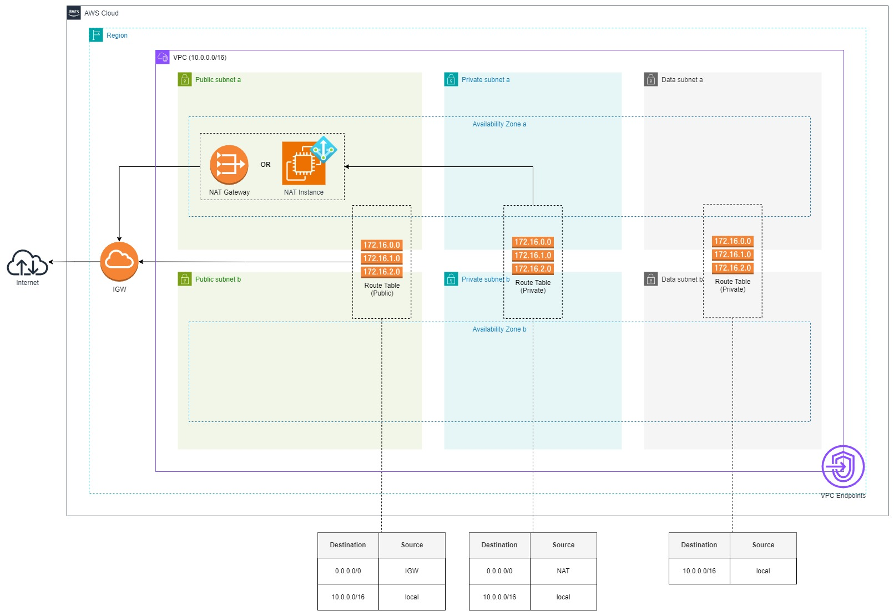

# Diagram

# Main Services in Use

| Service Name           | Role in Design                                       | Comments                                                                 |
|------------------------|------------------------------------------------------|--------------------------------------------------------------------------|
| VPC                    | Provides a logically isolated network                | CIDR range defined by `var.vpc_cidr`, supports DNS and flow logs         |
| Internet Gateway (IGW) | Allows public internet access for public subnets     | Used for outbound and inbound internet traffic                           |
| Subnets                | Divides the VPC into public, private, and data zones | CIDRs for subnets defined in `var.subnet_cidrs`                          |
| Security Groups        | Manages traffic at the instance level                | Configured for ALB, server, database, and internal communication         |
| NAT Gateway            | Provides internet access for private subnets         | Enabled when `var.enable_nat_gateways` is `true`                         |
| NAT Instance           | Alternative to NAT Gateway                           | Used when `var.enable_nat_gateways` is `false`, includes SSM integration |
| VPC Endpoints          | Enables private communication with AWS services      | Configured for S3, SSM, SSM Messages, and EC2 Messages services          |
| Route Tables           | Manages traffic routing within the VPC               | Separate route tables for public, private, and data subnets              |
| CloudWatch Flow Logs   | Logs network traffic within the VPC                  | Enabled when `var.enable_flow_logs` is `true`                            |
| ALB (Assumed)          | Manages traffic distribution for applications        | Supports path-based routing                                              |

# Terraform Parameters
## Variables
The default values are designed with a typical application centered around an Application Load Balancer (ALB) in mind.

| Name                  | Description                                                                        | Default Value                                                                                                 | Notes                                               |
|-----------------------|------------------------------------------------------------------------------------|---------------------------------------------------------------------------------------------------------------|-----------------------------------------------------|
| `name_prefix`         | The name prefix of the resources                                                   | None                                                                                                          | Required                                            |
| `region`              | The AWS region where resources will be deployed                                    | None                                                                                                          | Required                                            |
| `vpc_cidr`            | The CIDR block for the VPC                                                         | `10.0.0.0/16`                                                                                                 | Default VPC CIDR range                              |
| `subnet_cidrs`        | Map of subnet types to CIDR blocks                                                 | Public: `10.0.1.0/24, 10.0.2.0/24` Private: `10.0.3.0/24, 10.0.4.0/24` Data: `10.0.5.0/24, 10.0.6.0/24` | Defines CIDRs for public, private, and data subnets |
| `enable_flow_logs`    | Enable VPC flow logs                                                               | `false`                                                                                                       | Enable logging for network traffic                  |
| `security_groups`     | Security groups to create as a list of objects                                     | Predefined list of security groups for ALB, server, database, and internal communication                      | Customizable                                        |
| `enable_nat_gateways` | Enable NAT Gateways, or NAT Instance will be used                                  | `true`                                                                                                        | Use NAT Gateway or fallback to NAT Instance         |
| `nat_instance_type`   | NAT Instance type when NAT Gateways aren't used                                    | `t3.micro`                                                                                                    | Applicable only if NAT Gateway is disabled          |
| `vpc_endpoints`       | List of VPC endpoints to create. Each endpoint specifies its service name and type | S3: `Gateway` SSM: `Interface` SSM Messages: `Interface` EC2 Messages: `Interface`                   | Predefined for commonly used AWS services           |

## Outputs

| Name                 | Description                    | Value Example                    |
|----------------------|--------------------------------|----------------------------------|
| `vpc_id`             | The ID of the VPC              | `vpc-0123456789abcdef0`          |
| `public_subnet_ids`  | The IDs of the public subnets  | `["subnet-0123", "subnet-0456"]` |
| `private_subnet_ids` | The IDs of the private subnets | `["subnet-0789", "subnet-0999"]` |
| `data_subnet_ids`    | The IDs of the data subnets    | `["subnet-0101", "subnet-0202"]` |
| `security_groups`    | The security groups created    |                                  |
| `igw_id`             | The ID of the Internet Gateway | `igw-0123456789abcdef0`          |
| `nat_gateway_id`     | The ID of the NAT Gateway      | `["nat-0123456789abcdef0"]`      |
| `nat_instance_id`    | The ID of the NAT Instance     | `["i-013xz0a10419ka60j]"`        |

# Benefits of This Network Setup

- **Separation of Public, Private, and Data Subnets**

Public subnets are used for internet-facing resources like load balancers, while private subnets house application servers and databases. Data subnets can be isolated further for specific workloads like analytics or backups. This segmentation enhances security by limiting the exposure of critical resources to the internet. NAT Gateways or NAT Instances enable private subnets to access the internet securely without exposing internal resources.

- **High Availability**

The network spans multiple Availability Zones (AZs), ensuring fault tolerance and minimizing downtime. Even if one AZ fails, resources in other AZs remain operational, supporting critical business continuity.

- **VPC Endpoints for AWS Services**

VPC Endpoints allow direct, private access to AWS services like S3 and Systems Manager within the VPC, eliminating the need for internet gateways or public IPs. This setup enhances security by keeping all traffic within the AWS network.

# Scenarios Where This Network Setup Might Not Be Ideal

- **Organizations Using Shared VPC (e.g., Transit Gateway)**

If your organization uses a centralized Shared VPC setup for inter-VPC communication, this architecture may require significant customization or could result in redundant networking components like NAT Gateways or Internet Gateways.

- **Cost-Sensitive Use Cases**

This setup includes multiple subnets, NAT Gateways, and VPC Endpoints, which can increase costs. For small-scale or budget-constrained projects, simpler networking options may be more suitable.

- **Serverless-First Architectures**

If your workload primarily leverages serverless services like AWS Lambda, API Gateway, or DynamoDB, this infrastructure-heavy design may be excessive and add unnecessary complexity. Serverless architectures often require less emphasis on subnet segmentation and NAT configuration.